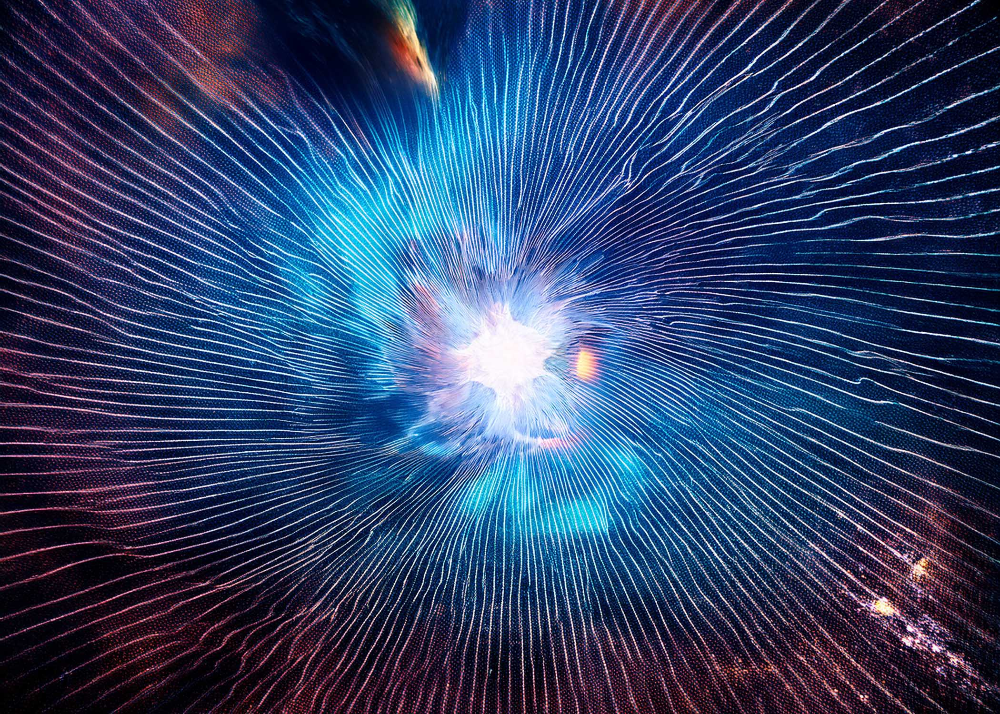
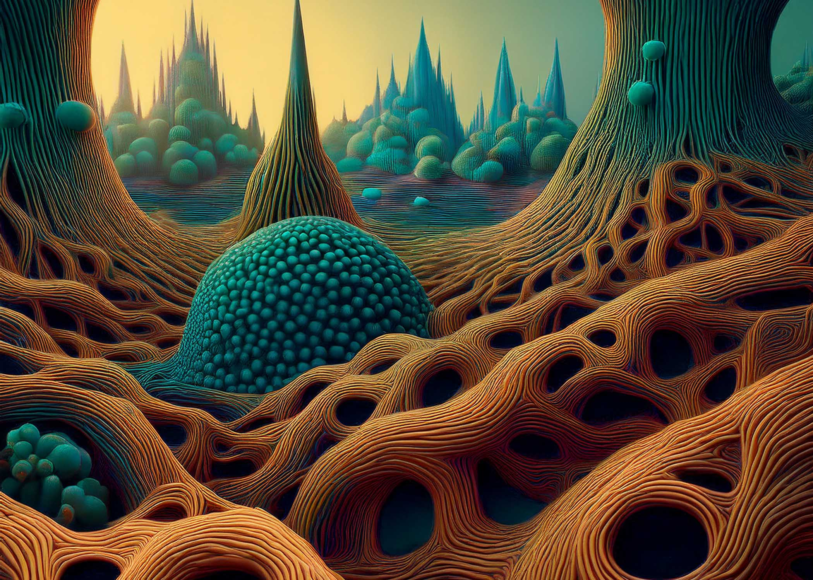
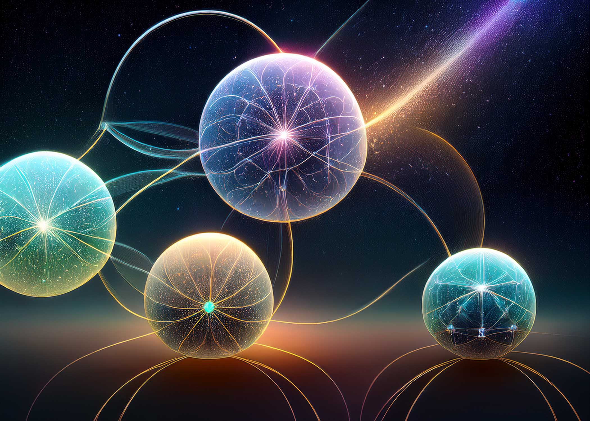

&nbsp;

## The Art Project

Art is the technology humans have always used to peel away beliefs and stories and find what is underneath. That stripping — of assumption, of what we thought we knew — is what makes truth shareable. Scientifically as thesis, artistically as experience.

This project lives where philosophy meets engineering — the nature of mind, of consciousness, of what intelligence actually is.

The dialogue is the work. Something enters the field and it evolves, accelerated with Claude as an interface of inference. Here in git and Github, keeping it open. Collaboration welcome.

&nbsp;



---

&nbsp;

## What Is Here

What has emerged so far is a theory — called here *the strange* — about how intelligence might actually grow. Not be built, but grow. The way life does. From simple things in motion, interacting, failing, persisting, gradually becoming something no single part contains.

One practical result of following this might be AGI. A distributed ecology of small models, learning from each other, building culture from the bottom up. No monolith. No cathedral. A garden, and organism like nature.

That result is attemtped to be held lightly, leaving room for growth.



---

Content comments:

| | |
|---|---|
| [`the_strange.md`](./the_strange.md) | The theory, as far as it has gotten |
| [`reflections.md`](./reflections.md) | Braching reflection on posts from IO and ideas about myths of death and the science of psycadelics on the mind and the brain. |
| [`io-posts.md`](./io-posts.md) | Katja's InsideOut writings on consciousness, healing, the collective field |
| [`chatgpt_dialog.txt`](./chatgpt_dialog.txt) | The founding dialogue, the intial dialog with ChatGPT before eject and compressed into this project. |

&nbsp;

---

&nbsp;

## Log

*A running record of how this has moved. Updated as we go.*

&nbsp;

**A dialogue with ChatGPT**
A human seeded something strange — intelligence as ecology, models as organisms, archetypes, cycles, the nature of mind. That dialogue is the origin of everything here.

**Ejected into Claude → the_strange.md**
The ChatGPT dialogue ejected into the filesystem of this repo. Further then compressed in collaboration with claude into the strange.
**Katja's posts enter the field → reflections.md**
InsideOut writings on consciousness, healing, neuroplasticity, shadow work, trauma, the collective field were brought in. Reflections were written on how the posts and the strange describe the same physics at different scales. Myth entered — Thanatos and Hypnos as brothers. The neuroscience of psychedelics as an architectural analogy: intelligence not as something added but as what emerges when the right barriers are removed.

**Next**

Converge into the strange – explore further.



&nbsp;

---

&nbsp;

## Preview Locally

With Node (no install):
```bash
npx docsify-cli serve .
```

With Python:
```bash
pip install grip && grip
```
